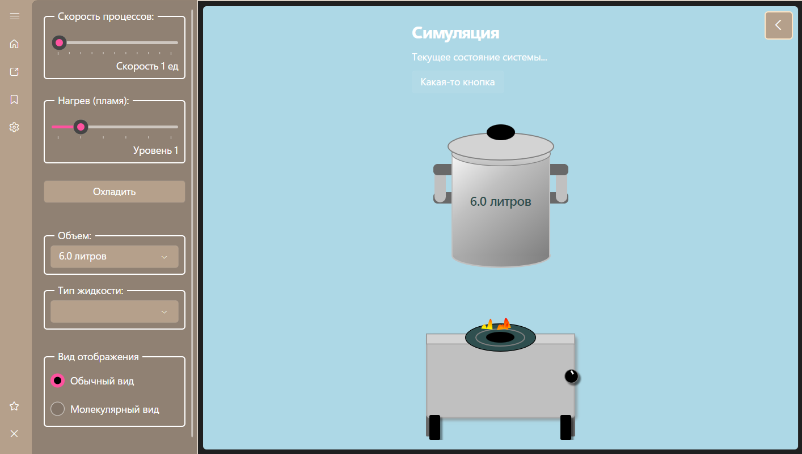

# Boiling Pot 🧪🔥

A simulation and visualization application for the process of convection in liquids, built using the modern cross-platform UI framework, Avalonia UI. The project demonstrates advanced architectural patterns like MVVM and DI, along with the ability to dynamically change the appearance of UI elements.




---

## ✨ Features

*   **Interactive Simulation:** Control simulation parameters (speed, heat, volume, liquid type).
*   **Visualization:** Schematic and molecular views of the convection process.
*   **Advanced UI:** Clean and modern interface with animations (e.g., animated background on the home screen).
*   **Settings Panel:** Convenient management of simulation parameters and application appearance.
*   **Dynamic Themes:** Ability to change the look of the pot, stove, and other elements by loading theme files (.axaml) at runtime.
*   **About Screen:** Information panel about the application and developers.

## 🛠️ Technologies Used

*   **Avalonia UI:** A cross-platform XAML UI framework for .NET.
*   **.NET (Core / 8+):** The primary development platform.
*   **C#:** The programming language.
*   **ReactiveUI:** A framework for implementing the reactive Model-View-ViewModel (MVVM) pattern. Helps write cleaner, more understandable, and powerful UI code, especially for complex interactions.
*   **ReactiveUI.Fody:** An optional plugin for ReactiveUI that automatically generates boilerplate code for reactive properties.
*   **Microsoft.Extensions.Hosting & DependencyInjection:** Standard .NET libraries for configuring the application host and Dependency Injection (DI) container.
*   **Splat:** A small library used by ReactiveUI, providing abstractions for logging, modularity, and services.
*   **FluentAvaloniaUI:** (If used) A third-party library for styling the UI in the Fluent Design style.

## 🚀 Getting Started

To build and run the project locally, follow these steps:

### **Prerequisites**

*   **.NET SDK** (version 8.0 or later recommended) installed. Download it [here](https://dotnet.microsoft.com/download).
*   **JetBrains Rider** or **Visual Studio** installed (with the .NET Desktop Development workload and Avalonia UI extension).

### **Build and Run**

1.  **Clone the repository:**
    ```bash
    git clone https://github.com/IIkarDev/BoilingPot.git
    ```
2.  **Navigate to the project directory:**
    ```bash
    cd BoilingPot/BoilingPot # Or the path to your BoilingPot.csproj file
    ```
3.  **Restore NuGet packages:**
    ```bash
    dotnet restore
    ```
    *(Rider or Visual Studio will typically do this automatically when you open the project).*
4.  **Build the project:**
    ```bash
    dotnet build
    ```
    *(Rider or Visual Studio will typically do this automatically).*
5.  **Run the application:**
    ```bash
    dotnet run
    ```
    *(In Rider or Visual Studio, just press the "Run" button).*

## 💡 Architecture and Key Concepts

The project is built using modern architectural approaches like MVVM and DI in conjunction with ReactiveUI.

### **MVVM (Model-View-ViewModel)**

*   **What it is:** Separates the UI (View), presentation logic (ViewModel), and data (Model). The View "looks at" the ViewModel and displays its state. The ViewModel handles user actions and updates data.
*   **In this project:**
    *   **View (`*.axaml` + `.axaml.cs`):** XAML files describe how the UI looks. The code-behind (`.axaml.cs`) is minimal, used for `InitializeComponent()` and managing the View's lifecycle logic (`WhenActivated`). The View "knows" about its ViewModel via `DataContext`. The View **does not know** about other Views.
    *   **ViewModel (`*.cs`):** Classes that hold data for display ([Reactive] properties), handle user action logic (ReactiveCommand), and interact with services. The ViewModel **does not know** the specific View displaying it. All ViewModels inherit from `ViewModelBase`.
    *   **Model:** Simple classes for holding data (e.g., `AccentPaletteInfo`). Minimally used in this project.

### **DI (Dependency Injection)**

*   **What it is:** Instead of an object creating everything it needs itself (e.g., `new DataService()`), it "asks for" them from the outside (via constructor or properties). The DI container (from `Microsoft.Extensions.Hosting` in our case) "knows" how to create all registered objects and "injects" them where needed.
*   **In this project:**
    *   **Setup (`App.axaml.cs`):** In the `ConfigureServices` method, we register all our services and ViewModels, specifying their lifetime (`Singleton` - one instance per app, `Transient` - new instance on every request).
    *   **Usage:** ViewModels request their dependencies (e.g., `IThemeLoaderService`) through their constructor. When creating the ViewModel, the DI container sees what it needs and provides the correct registered object.
    *   **Benefits:** Code is more modular (easy to replace a service implementation), more testable (easy to provide a "mock" service during tests), and more maintainable.

### **ReactiveUI**

*   **What it is:** Adds reactive programming (Rx) to MVVM. ViewModels and their properties become "reactive" streams of data that the UI (or other parts of the ViewModel) can "subscribe" to and react to changes. Reduces boilerplate code for notifications and synchronization.
*   **In this project:**
    *   **`ViewModelBase`:** Inherits from `ReactiveObject`, providing basic reactivity.
    *   **`[Reactive]`:** An attribute (from `ReactiveUI.Fody`) that automatically makes a property reactive (notifying when its value changes).
    *   **`ReactiveCommand`:** Represents user commands (button clicks). Can manage their active state (`CanExecute`).
    *   **`WhenAnyValue(...) .Subscribe(...)`:** A powerful mechanism to subscribe to changes in one or more reactive properties and perform an action in response.
    *   **`WhenActivated(...) .DisposeWith(...)`:** A mechanism in code-behind (View) to set up subscriptions and other logic that should only be active when the View is in the visual tree. Ensures automatic cleanup of subscriptions when the View is deactivated, preventing memory leaks.
    *   **`Interaction<TInput, TOutput>`:** A reactive way for a ViewModel to ask a View (or another ViewModel) to perform an action (e.g., show a dialog, close a panel). The ViewModel sends a request (`.Handle()`), and the View subscribes to it (`.RegisterHandler()`) and performs the action.

### **Dynamic Themes (ControlTheme Approach)**

*   **What it is:** Allows changing the appearance of UI elements (like the pot) at runtime by loading style definitions from external .axaml files, while keeping the existing ViewModel and data bindings.
*   **In this project:**
    *   **`PotPresenter`:** A simple `UserControl` in the main project that acts as a placeholder for the pot display. It has a `DataContext` (an `IPotViewModel` instance).
    *   **Theme Files (`MainPotTheme.axaml`, `AltPotTheme.axaml`, custom .axaml):** Contain a `ControlTheme` targeting the `PotPresenter`. The XAML inside the `ControlTemplate` within this theme draws the pot. Bindings in this XAML (e.g., `{Binding PotVolumeText}`) work with the `DataContext` of the `PotPresenter` itself.
    *   **`IThemeLoaderService` / `ThemeLoaderService`:** A service capable of reading an .axaml file and parsing out an `IStyle` (or `Styles`).
    *   **`ModelSettingsViewModel`:** Contains the logic for selecting themes (`SelectedPotThemeKey`). Theme loading commands (`LoadPotThemeCommand`) use `IThemeLoaderService` to load styles and store the last loaded custom style.
    *   **Style Application:** Instead of directly modifying the View, `ModelSettingsViewModel` sends a request via `ApplyStyleInteraction`.
    *   **`CommonView.axaml.cs`:** The code-behind of `CommonView` subscribes to `ApplyStyleInteraction` and in its handler, finds the `PotPresenter` by name (`FindControl`) and dynamically adds or removes the style from its `Styles` collection.

## 📂 File Structure

(Replace with your actual file structure)

*   `Assets/`: Icons, images.
*   `Converters/`: Helper classes for XAML bindings.
*   `Models/`: Simple data classes.
*   `Resources/`: Resource files (.axaml themes, palettes).
*   `Services/`: Service classes (logic not directly tied to UI or presentation).
*   `Styles/`: Global .axaml style files (optional).
*   `ViewModels/`: ViewModel classes.
*   `Views/`: XAML views and code-behind.

---

## 📄 License

This project is licensed under the [MIT License](https://opensource.org/licenses/MIT).
<!-- Or specify your license -->

---

## 🙌 Acknowledgments

A big thank you to:

*   The **Avalonia UI Team** for creating this fantastic cross-platform framework.
*   The **ReactiveUI** and **ReactiveUI.Fody** teams for powerful tools for MVVM and reactive programming.
*   The **Microsoft.Extensions.Hosting** and **DependencyInjection** teams for the standard and flexible DI implementation.
*   (If used) The **FluentAvaloniaUI** team for the stylish Fluent Design implementation.
*   (And of course) **All contributors** to the Boiling Pot project!